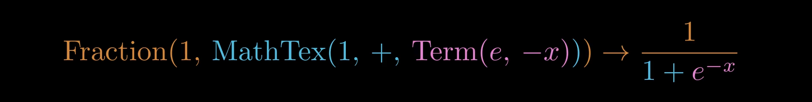

# Reactive Manim




[](https://discord.gg/nbZuR4t76M)

Easily create and animate math expressions in manim. Reactive-manim reduces the programming overhead of creating animations that animate individual parts of an equation, through the use of reusable math components that are reactive to changes in state.


<p align="center">
  <a href="https://philip-murray.github.io/reactive-manim"><strong>https://philip-murray.github.io/reactive-manim</strong></a>
</p>

<br></br>

**Reusable Math Components**


<br></br>
**Component Composition**


<br></br>
**Automatic Animation**


<br></br>


➡️ [Examples](#examples) ⬅️ 
Click for more examples.

<br>
<br>

## Install

⚠️ An extension for **ManimCE version 0.18.1**

```sh
pip install reactive-manim
```

<br>
<br>

⚠️ `reactive_manim` overwrites the definition for MathTex, it must be imported after importing `manim`.

```python
from manim import *
from reactive_manim import *
```

<br>
<br>

## Examples

Note: The stuttering in the animations is a result of using gif files for the README. It does not occur when rendering mp4 files.

<br>

##### Exponent Animation


```python
class ExponentScene(Scene):
    def construct(self):

        term1, term2 = Term("2"), Term("2", "4")
        tex = MathTex(term1, Parentheses(term2))
        self.add(tex).wait(1)

        term2.term.save_y()

        term1.term.target_id = term2.term.id
        term2.superscript.set_tex_string("5")
        tex.terms = [ term2 ]
        term2.term.restore_y()

        self.play(TransformInStages.progress(tex, lag_ratio=0.4))
        self.wait(1)
```

<br>
<br>

##### Natural Log Animation


```python
class NaturalLogScene(Scene):
    def construct(self):

        tex = MathTex("a", "=", "b")
        self.add(tex).wait(0.5)

        tex[0] = Term("e", tex[0])
        tex[2] = Term("e", tex[2])
        self.play(TransformInStages.progress(tex, lag_ratio=0.6))

        tex[0] = Function(r"\ln", tex[0])
        tex[2] = Function(r"\ln", tex[2])
        self.play(TransformInStages.progress(tex, lag_ratio=0.6))

        tex[0] = MathTex(tex[0].input.superscript.pop(), tex[0])
        tex[2] = MathTex(tex[2].input.superscript.pop(), tex[2])
        self.play(TransformInStages.progress(tex))

        tex[0] = tex[0][0]
        tex[2] = tex[2][0]
        self.play(TransformInStages.progress(tex, lag_ratio=0.8))
```

<br>
<br>

##### Piecewise Animation

```python
class CasesScene(Scene):
    def construct(self):

        tex = MathTex("f(x) =", MathCases(
            CaseLine(r"b,     ", r"\text{even}(x)"),
            CaseLine(r"\neg b,", r"\text{odd}(x)"),
            CaseLine(r"?,",      r"\text{otherwise}"),        
        ))
        self.add(tex).wait(1)

        cases = tex[1]
        cases[1].condition.set_color(ORANGE)
        cases[2].output.set_color(ORANGE)

        self.play(TransformInStages.progress(tex))
        
        cases[1].condition = cases[2].condition
        cases.lines = [ cases[0], cases[1] ]   

        self.play(TransformInStages.progress(tex, lag_ratio=0.4, run_time=1.5))
        self.wait(2)
```

<br>
<br>


##### MathMatrix Animation


```python
class MatrixScene(Scene):
    def construct(self):

        y0, y1 = Term("y", subscript=0), Term("y", subscript=1)
        x0, x1 = Term("x", subscript=0), Term("x", subscript=1)

        w00, w01 = Term("w", subscript="00"), Term("w", subscript="01")
        w10, w11 = Term("w", subscript="10"), Term("w", subscript="11")

        tex1 = MathTex(y0, "=", w00, x0, "+", w01, x1)
        tex2 = MathTex(y1, "=", w10, x0, "+", w11, x1)

        group = DGroup(tex1, tex2).arrange(DOWN).shift(UP)
        self.add(group).wait(2)

        tex3 = MathTex(
            MathMatrix([
                [ y0 ],
                [ y1 ]
            ]), 
            "=",
            MathMatrix([
                [ w00, w01 ],
                [ w10, w11 ]
            ]),
            MathMatrix([
                [ x0 ],
                [ x1 ]
            ])
        )
        tex3.shift(DOWN)
        
        self.play(TransformInStages.from_copy(group, tex3[0],      lag_ratio=0.4, run_time=2.5))
        self.play(TransformInStages.from_copy(group, tex3[1],      lag_ratio=0.4, run_time=1.4))
        self.play(TransformInStages.from_copy(group, tex3[2],      lag_ratio=0.4, run_time=2.5))
        self.play(TransformInStages.from_copy(group, tex3[3] - x0, lag_ratio=0.4, run_time=2.5))
        self.play(TransformInStages.from_copy(group, x0,           lag_ratio=0.4, run_time=2.5))
        self.wait(2)
```
This example makes careful use of auto-disconnect.

<br>
<br>

##### Equation Variables


```python
class EquationVariablesScene(Scene):
    def construct(self):
        
        y_pred = MathString("6.75")
        y_act = MathString("9.0")
        tex = MathTex(r"E = \frac{1}{2}(", "y", "-", "a", ")^2")

        y_pred.move_to(np.array([ -1.0, 1.25, 0 ]))
        y_act.move_to(np.array([ 1.0, 1.25, 0 ]))
        tex.move_to(np.array([ 0, -0.5, 0 ]))
        self.add(y_pred, y_act, tex).wait(1)

        tex[1] = y_pred.copy()
        anim = TransformInStages.progress(tex, lag_ratio=0, run_time=1.5)
        anim.intercept(y_pred).set_source(y_pred)

        self.play(anim)
        self.wait(1)

        tex[0].save_center()
        tex[3] = y_act.copy()
        tex[0].restore_center()
        anim = TransformInStages.progress(tex, lag_ratio=0, run_time=1.5)
        anim.intercept(y_act).set_source(y_act)

        self.play(anim)
        self.wait(1)
```
This uses `animation.intercept()`, which is not discussed in the guide section because it is still in development. 

However, the same result could be accomplished without `animation.intercept()` using the `from_copy()` constructor of `TransformInStages`. 

<br>
<br>

##### MathList Animation


```python
class MathListScene(Scene):
    def construct(self):

        tex = MathList("4", "7", "1", "2")
        self.add(tex).wait(1)

        tex.remove(tex[1])
        self.play(TransformInStages.progress(tex, lag_ratio=0.8))
        self.wait(1)

        tex.append("3")
        self.play(TransformInStages.progress(tex, lag_ratio=0.8))
        self.wait(1)

        four = tex[0]
        tex.remove(four)
        tex.append(four)

        animation = TransformInStages.progress(tex, lag_ratio=0.5, track_run_time=1.5)
        animation.intercept(four).set_animation(
            lambda source, target: Transform(source, target, path_arc=(3*PI)/4)
        )
        self.play(animation)
```
This uses `MathList`, which is not discussed in the guide section because it is still in development. 

This uses `animation.intercept()`, which is not discussed in the guide section because it is still in development. 

<br>
<br>

##### Quadratic Scene


```python
class QuadraticScene(Scene):
    def construct(self):
        
        a1, p1, b1 = MathTex("a", "+", "b")

        tex1 = MathTex(Parentheses([ a1, p1, b1 ]), Parentheses([ "a", "-", "b" ])).shift(UP)
        self.add(tex1).wait(1)
        tex1[1].set_color(BLUE)
        self.play(TransformInStages.progress(tex1))
        
        paren_2 = tex1[1]

        tex2 = MathTex([ a1, paren_2 ], [ [ p1, b1 ], paren_2 ])
        self.play(TransformInStages.from_copy(tex1, tex2[0], run_time=1.5))
        self.play(TransformInStages.from_copy(tex1, tex2[1], run_time=1.5))
        self.wait(1)

        a2, m2, b2 = tex2[0][1].inner
        a3, m3, b3 = tex2[1][1].inner

        part1 = Term(a1, "2")
        a2.target_id = a1.id

        part2 = MathTex(m2, a1.clone(), b2)
        part3 = MathTex(p1, a3, b1.clone())
        part4 = MathTex(m3, Term(b2, "2"))
        b3.target_id = b2.id

        tex3 = MathTex(part1, [ part2, part3 ], part4).shift(DOWN).set_color(WHITE)

        self.play(TransformInStages.from_copy(tex2, part1, lag_ratio=0.4, track_run_time=1.5))
        self.play(TransformInStages.from_copy(tex2, part2, lag_ratio=0.4, track_run_time=1.5))
        self.play(TransformInStages.from_copy(tex2, part3, lag_ratio=0.4, track_run_time=1.5))
        self.play(TransformInStages.from_copy(tex2, part4, lag_ratio=0.4, track_run_time=1.5))

        point_mobject = tex3[1].get_point_dynamic_mobject().shift(DOWN*0.05)
        tex3.terms = [ tex3[0], tex3[2] ]

        anim = TransformInStages.progress(tex3, lag_ratio=0)
        anim.intercept(point_mobject).set_target(point_mobject)
        self.play(anim)
        self.wait(1)
```

<br>
<br>

## Guide

- [MathTex, MathString](#mathtex-mathstring)
    - [String-as-MathString syntax](#string-as-mathstring-syntax)
    - [MathTex Methods](#mathtex-methods)

- [Transforms](#transforms)
    - [Progression](#progression)
    - [Replacement Transform](#replacement-transform)
    - [Transform from Copy](#transform-from-copy)
    
- [Components](#components)
    - [DGroup](#dgroup)
    - [Term](#term)
    - [Fraction](#fraction)
    - [Function and Parentheses](#function-and-parentheses)
    - [Component Composition](#component-composition)
    - [Array-as-MathTex syntax](#array-as-mathtex-syntax)
    - [MathCases](#mathcases)
    - [CaseLine](#caseline)
    - [MathMatrix](#mathmatrix)

- [Mobject Controls](#mobject-controls)
  - [Clone](#clone)
  - [Auto-Disconnect](#auto-disconnect)
  - [Pop](#pop)
  - [target_id](#target_id)
  - [restore_center, restore_x, restore_y](#restore_center-restore_x-restore_y)
  - [Constructing sequential target-mobjects using auto-disconnect](#constructing-sequential-target-mobjects-using-auto-disconnect)
- [Partial Transformation](#partial-transformation)

### MathTex, MathString


Mobjects including *tex*, *x*, and *y* are components of an **mobject-graph** where *tex* is the root. Methods that change a component's state, for example `z.set_tex_string(tex_string)` or `tex.remove(term)`, trigger a rerender that propagates to the root. The root's position is unaffected by state changes. 

I use the phrases **mobject** and **mobject-graph** interchangeably, because in certain contexts, an mobject can be thought to implicitly include its children. We will observe in the section on partial progression, that `progress(tex)` is interpreted as a subgraph of `tex.graph` that includes `tex.id` and the IDs of its recursive descendants. 

<br>

##### String-as-MathString syntax


In nested constructions, a string can be used as a shorthand syntax to denote a MathString. 

<br>
<br>

##### MathTex methods
The tex_string of a MathTex is generated by concatenating the tex_strings of its child components or "terms". The list of terms can be changed programmatically, via 

- `remove(term)`
- `append(term)`
- `insert(index: int, term)`
- `__setitem__(self, index, term)`
  - tex[0] = term
- `@terms.setter`
  - tex.terms = [ term1, term2 ]
<br>

MathTex does not currently support kwargs. However, default kwargs such as tex_template can be set using `SingleStringMathTex.set_default(tex_template=...)`

<br>
<br>

### Transforms

Every mobject derived from `DynamicMobject` has an ID. An mobject-graph-transform is an animation between between a source_graph and target_graph, guided by IDs. For each ID, an mobject representing that ID is interpolated between `source_graph[id]` and `target_graph[id]`, if both exist.

#####  Progression


<br>

In this example:

- The `source_graph` is taken at `scene.add(tex)`
    - Refreshed by `scene.wait()`
    - Refreshed by changes in state following a progress transform.

- The `target_graph` is taken at `TransformInStages.progress(tex)`


`attach_progress_interceptors` overwrites `scene.add()` with a function that saves a copy of the mobject-graph, if the mobject is of type `DynamicMobject`.

<br>
<br>

**TransformInStages** is currently the only available automatic animation. 

- If an ID is only found in the source_graph, `TransformInStages` constructs a FadeOut target_mobject. These mobjects are **removers**. 

- If an ID is only found in the target_graph, `TransformInStages` constructs a FadeIn source_mobject. These mobjects are **introducers**.


- `lag_ratio: float = 1`
  - lag_ratio for the remover, transformer, and introducer tracks. 

- `run_time: float | None = None`
  - The run_time for the entire animation. If `None`, track_run_time is used instead.

- `track_run_time: float | None = 1`
  - The run_time provided for the remover, transformer and introducer tracks individually. The default value of 1 yields a 3-second animation if all 3 remover, transformer, and introducer types are present.


<br>

##### Replacement Transform


```python
tex1 = MathTex("a", "b", "c")
tex2 = MathTex(tex1[1].copy(), tex1[2].copy(), "d")

self.add(tex1)
self.wait(1)

self.play(TransformInStages.replacement_transform(tex1, tex2, lag_ratio=0.5))

tex1.set_color(RED)
tex2.set_color(GREEN)
self.wait(2)
```

`replacement_transform` removes the source_mobject from the scene, and adds the target_mobject. `Mobject.copy()` copies the ID of a `DynamicMobject` and the IDs of its children, the copied IDs are recognized by the animation generator. An mobject-graph cannot have two mobjects with the same ID, so `MathTex(a, a.copy())` will raise an error, whereas `MathTex(a, a.clone())` does not.


<br>
<br>

##### Transform from Copy


```python
tex1 = MathTex("a", "b", "c").shift(UP)
tex2 = MathTex(tex1[1].copy(), tex1[2].copy(), "d")

self.add(tex1)
self.wait(1)

self.play(TransformInStages.from_copy(tex1, tex2, lag_ratio=0.5))

tex1.set_color(RED)
tex2.set_color(GREEN)
self.wait(2)
```

<br>
<br>


<br>
</br>

### Components

##### DGroup


```python
class Scene1(Scene):
    def construct(self):
        attach_progress_interceptors(self)

        tex1 = MathTex("a", r"\\", "b")
        tex2 = MathString("x + y")

        group = DGroup(tex1, tex2).arrange(DOWN, buff=LARGE_BUFF)
        self.add(group).wait(1)

        tex1.terms = [ tex1[0], tex1[2] ]

        self.play(TransformInStages.progress(group))
        self.wait(1)
```

DGroup is a reactive version of VGroup. It also enables multiple equations to be placed in the same mobject-graph, where the group is the root-mobject. Using DGroup, making an animation that moves a term from one equation to another equation, is handled the same way as moving a term within the same equation. That is, as a *transformer* type and not an *introducer* or *remover* type.

- `@mobjects.setter`
- `add(*mobjects)`
- `remove(*mobjects)`
- `arrange(self, direction = RIGHT, buff = DEFAULT_MOBJECT_TO_MOBJECT_BUFFER, center = True, **kwargs)`

Currently, `arrange` is the only arrangement method supported.

<br>
<br>

##### Term


```python
class TermComponent(Scene):
    def construct(self):
        attach_progress_interceptors(self)

        term = Term("a", "b", "c")

        term.term.set_color(RED)
        term.subscript.set_color(YELLOW)
        term.superscript.set_color(BLUE)
        self.add(term).wait(2)

        term.subscript = None
        term.superscript.set_tex_string("2")
        self.play(TransformInStages.progress(term))
        self.wait(2)
```


Term can have `None` for superscript, and subscript, and `Term(term, superscript=None, subscript=None)` renders equivalent to `MathTex(term)`. 


- `@term.setter`
- `@subscript.setter`
  - `None` supported
- `@superscript.setter`
  - `None` supported

<br>

##### Fraction

```python
class FractionComponent(Scene):
    def construct(self):
        attach_progress_interceptors(self)

        fraction = Fraction("a", "b")
        fraction.numerator.set_color(RED)
        fraction.denominator.set_color(BLUE)
        fraction.vinculum.set_color(LIGHT_BROWN)

        self.add(fraction).wait(2)

        fraction.numerator, fraction.denominator = fraction.denominator, fraction.numerator
        self.play(TransformInStages.progress(fraction))
```

The numerator and denominator cannot be `None`.
The vinculum has no setter. 

- `@numerator.setter`
- `@denominator.setter`
- `@property vinculum`

<br>

##### Function and Parentheses


```python
class FunctionComponent(Scene):
    def construct(self):
        attach_progress_interceptors(self)

        function = Function(r"\text{ln}", "x")
        function.function_name.set_color(YELLOW)
        function.input.set_color(LIGHT_BROWN)
        function.shift(UP)

        parentheses = Parentheses("x")
        parentheses.inner.set_color(LIGHT_BROWN)

        self.add(function, parentheses)
```

The property `name` is used by Mobject, so I made the function's name property `function_name`.

There is `function.bracket_l` and `function.bracket_r`, but I might change that in the future to a use the parentheses component. Parentheses also has `parentheses.bracket_l` and `parentheses.bracket_r`.

<br>
<br>

##### Component Composition


Let's see how the RHS could be implemented:


##### Array-as-MathTex syntax
In nested constructions, an array can be used as a shorthand syntax to denote a MathTex. In the below code sample, the first green box will be interpreted as `Term("e", MathTex("-", "x"))`. The second green box will be interpreted as `Fraction(MathTex("d", tex[0]), "dx")`.


<br>
<br>


##### MathCases


```python
class Scene1(Scene):
    def construct(self):
        attach_progress_interceptors(self)

        cases = MathCases("a", "b", "c").set_color(GREEN)
        self.add(cases).wait(1)

        cases.remove(cases[0])
        cases.append("d")

        self.play(TransformInStages.progress(cases, lag_ratio=0.5))

        cases.lines = [ cases[0], cases[2], cases[1] ]
        cases.shift(LEFT)

        self.play(TransformInStages.progress(cases, lag_ratio=0.5))
        self.wait(1)
```
MathCases is similar to MathTex as it uses a list to store it's children. Instead of `tex.terms` we have `cases.lines`.

<br>

##### CaseLine


```python
cases = MathCases(
    "a, & b",
    CaseLine("aaa,", "b")
)
self.add(cases)

cases.set_color(GREEN)
cases[1].output.set_color(RED)
cases[1].condition.set_color(BLUE)
```

At first, I wanted to have `CaseLine(output, condition)` be `"{output},  & if {condition}"`, but I found examples without commas or without if statements. So currently it separates the output and condition with an alignment character, or `"{output} & {condition}"`. 

<br>

##### MathMatrix

MathMatrix is a component for a LaTeX bmatrix, which is visually different from manim's Matrix implementation. 


```python
class Scene1(Scene):
    def construct(self):
        attach_progress_interceptors(self)
        root = DGroup()

        mat = MathMatrix([[ "x", "z" ], [ "y", "w" ]]).set_color(LIGHT_PINK)
        self.add(root.add(mat)).wait(1)

        mat.matrix = [
            [ "a", mat[0][0] ],
            [ "b", mat[1][0] ]
        ]
        self.play(TransformInStages.progress(root, lag_ratio=0.4, run_time=1.5))
        self.wait(1)

        root.mobjects = [ Term("e", mat) ]
        self.play(TransformInStages.progress(root, lag_ratio=0.4, run_time=1.5))
        self.wait(1)
```

Getting an element via `matrix[0][0]` is supported, but editing via `matrix[0][0] = elem` is not supported. Edits must be made through the `matrix.matrix` setter providing a 2D list. 

In this example, we see it's possible for a matrix to be a superscript. However, the default LaTeX rendering is not ideal, the matrix should be smaller in the subscript position. The transformation of the brackets is also not ideal, you will notice a wobble in brackets as it moves into the superscript position. This is because the brackets acquire more submobjects as they get taller, or when they are placed in an superscript position. This mismatch in the submobject count causes the wobble during the render. 


<br>
<br>

#### Mobject Controls

##### Clone

An mobject-graph cannot have two mobjects with the same id. Therefore, `clone()` must be used instead of `copy()` when placing a copy of an mobject within the same graph. 

TransformInStages recognizes that an mobject B is a clone of another mobject A, if B's **source_id** matches A's id.


```python
class Scene1(Scene):
    def construct(self):
        attach_progress_interceptors(self)

        tex = MathTex(Term("x", "n"))
        self.add(tex).wait(1)

        tex.terms = [ tex[0], tex[0].clone() ]
        self.play(TransformInStages.progress(tex))
```

In this example, the `Term`, `MathString("x")` and `MathString("n")` in `tex[0].clone()` each have a **source_id** corresponding to a component in `tex[0]`.


<br>
<br>

##### Auto-Disconnect

Auto-disconnect enables notation such as `A[0] = Component(A[0])`, by disconnecting child from its parent without changing the list size of the parent component.

Given a construction A(B), where B is a child of A, if you attempt to construct Component(B) without disconnecting the parent/child relationship between A and B, then B will be disconnected from A by means of rerendering A with B.clone() in place of B.


In this example, `x` is rerendered using `n.clone()` in place of `n`. 

<br>
<br>

##### Pop

Given a construction A(B), where B is a child of A, the use of B.pop() is a shorthand for A.remove(B). This may throw a NotImplementedError if A does not override the abstract `remove` method declaration in `DynamicMobject`. 


In this example, `n.pop()` executes `x.remove(n)`. Term's implementation of `remove` recognizes that n is its superscript, and sets its superscript to `None`. Then `n` is available to be placed inside `tex`.

<br>
<br>


##### target_id

Enables a remover-mobject to merge onto another mobject during a transformation. Both source_id and target_id are set back to `None` after transformations. 


```python
class Scene1(Scene):
    def construct(self):
        attach_progress_interceptors(self)

        term1 = Term("2")
        term2 = Term("2", "4")

        tex = MathTex(term1, Parentheses(term2))
        self.add(tex).wait(1)

        term1.term.target_id = term2.term.id
        term2.superscript.set_tex_string("5")
        tex.terms = [ term2 ]

        self.play(TransformInStages.progress(tex, lag_ratio=0.4))
```

<br>
<br>

##### restore_center, restore_x, restore_y

In the above example, the vertical position of the 2 changes when the parentheses are removed. In the below example `save_y` and `restore_y` restore the vertical position of the 2, making it move only horizontally. 


```python
class Scene1(Scene):
    def construct(self):
        attach_progress_interceptors(self)

        term1 = Term("2")
        term2 = Term("2", "4")

        tex = MathTex(term1, Parentheses(term2))
        self.add(tex).wait(1)

        term2.term.save_y()

        term1.term.target_id = term2.term.id
        term2.superscript.set_tex_string("5")
        tex.terms = [ term2 ]
        term2.term.restore_y()

        self.play(TransformInStages.progress(tex, lag_ratio=0.4))
```

In this example, the original 2 remains at the same position during the animation. This is due to `save_y()` and`restore_y()` being called. 

By default, `restore` shifts the root mobject by the difference of the before and after positions of the mobject that `restore` is being called on. 


<br>

##### Constructing sequential target-mobjects using auto-disconnect

**Without auto-disconnect**

In setting up an animation using the `from_copy()` constructor, if the target mobject is generated using copies of the original mobject's components, then the copies will remain components of the original mobject. 

 
```python
class Scene1(Scene):
    def construct(self):
        
        x = MathString("x")
        y = MathString("y")

        tex1 = MathTex(x, y)
        tex1.shift(UP)
        self.add(tex1).wait(1)

        tex2 = MathTex(y.copy(), x.copy())
        self.play(TransformInStages.from_copy(tex1, tex2))

        x.set_color(RED)
        y.set_color(RED)
        self.wait(3)
```

<br>

**Using auto-disconnect**

However, using auto-disconnect, we can construct a target_mobject directly using the components of the original mobject. This is because replacement copies will be generated by auto-disconnect to fill in for the missing components of the original mobject. Then we can edit the components (that were formerly apart of the original mobject), to edit the new target mobject. 


```python
class Scene1(Scene):
    def construct(self):
        
        x = MathString("x")
        y = MathString("y")

        tex1 = MathTex(x, y)
        tex1.shift(UP)
        self.add(tex1).wait(1)

        tex2 = MathTex(y, x)
        self.play(TransformInStages.from_copy(tex1, tex2))

        x.set_color(RED)
        y.set_color(RED)
        self.wait(1)

        tex3 = MathTex(x, y)
        tex3.shift(DOWN)
        self.play(TransformInStages.from_copy(tex2, tex3))

        x.set_color(BLUE)
        y.set_color(BLUE)
        self.wait(3)
```


<br>
<br>
<br>


### Partial Transformation

Partial transformation is still in development, it has unresolved problems. 

All three transformation constructors support partial transformation. 

When `TransformInStages` is provided a subcomponent of an mobject-graph, it uses the complete mobject-graph to construct the transformation, and uses the subcomponent as an ID selection to determine which IDs to animate. 

When provided a subcomponent, the animation generator includes the subcomponent's ID, and recursively includes its descendants in the ID selection. For example, in `tex = MathTex("y, "=", Term("e", ["-", "x"])`, passing in the term subcomponent would include an ID selection for: Term, MathString("e"), MathTex("-", "x"), MathString("-") and MathString("x").

Using partial transforms requires multiple transforms to cover the total transformation of an mobject-graph from a source_graph to target_graph. Therefore, the progress constructor does not update the target state of the mobject-graph if it's a subsequent transform. This enables subsequent transforms to use the same target state that the first progress constructor uses. Wait calls between progress constructors do not update the target state. The first state change to the mobject-graph following a progress constructor is interpreted as the conclusion of the partial progressions. 